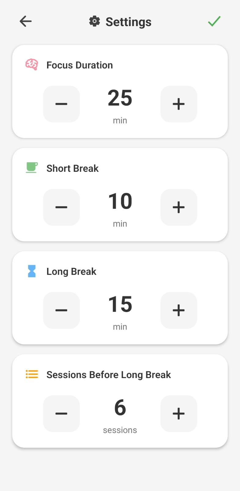

# Pomodoro ⏳

A beautifully designed Pomodoro timer built with **React Native + Expo**, featuring session tracking, customizable settings, and responsive, minimalist UI. Stay focused, manage your breaks, and boost productivity!

---

## 📑 Table of Contents

- [Tech Stack](#-tech-stack)
- [Features](#-features)
- [How to Try This Project Out](#-how-to-try-this-project-out)
- [Screenshots](#-screenshots)
- [Demo](#-demo)

---

## 🚀 Tech Stack

- **React Native (Expo)**
- **TypeScript**
- **Expo AV** — for playing completion sounds
- **AsyncStorage** — to persist session data
- **React Native Vibration API**
- **Expo Vector Icons**

---

## ⚙️ Features

✅ Focus, Short Break, and Long Break modes  
✅ Customizable durations and session counts  
✅ Sound and vibration notifications  
✅ Persistent settings and progress  
✅ Responsive, minimalist UI

---

## 🧩 How to Try This Project Out

### 1. Clone the repository

```bash
git clone git@github.com:Muza21/pomodoro.git
cd pomodoro
```

### 2. Install dependencies

```bash
npm install
```

### 3. Start the Expo development server

```bash
npx expo start
```

### 4. Run it

- On your phone: Scan the QR code with Expo Go app.

- On emulator: Press a for Android or i for iOS.

## 🖼️ Screenshots

<div style="display: flex; justify-content: center; gap: 20px;">
  <div style="text-align: center;">
    <p><strong>Focus Mode</strong></p>
    
  </div>
  <div style="text-align: center;">
    <p><strong>Short Break</strong></p>
    
  </div>
  <div style="text-align: center;">
    <p><strong>Long Break</strong></p>
    
  </div>
  <div style="text-align: center;">
    <p><strong>Settings Screen</strong></p>
    
  </div>
</div>

## 🎬 Demo

Watch the Pomodoro timer in action:

<p align="center">
  
</p>
